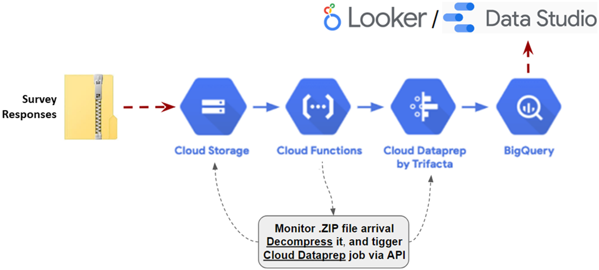

# processing-google-forms-survey-data-in-gcp:
Building an automated pipeline in Google Cloud Platform to decompress, prepare and perform visual analytics on responses collected with Google Form surveys.

Assets for demonstration of the blog post **"Automated End-to-End Solution to Process and Visualy Analyze Google Form survey responses"(https://docs.google.com/document/d/1hEo_qrrykVZq19rN2kZ5ZgjNFID9odsEehN0Tlj9v-w/edit#heading=h.ep3hsi5hfvb9)**

- **[flow_Google Form Analytics Design Pattern.zip](https://github.com/victorcouste/demo-trigger-dataprep-job-from-gcs/blob/master/flow_dataprep_demo.zip)** : Dataprep Flow package example to import from Dataprep UI.

- **[mockarooAKS.csv](https://github.com/aagithubb/processing-google-forms-survey-data-in-gcp-I/blob/main/mockarooAKS.csv)** : Example of survey responses CSV file used as one of inputs of the flow example and to be stored in the Google Cloud Storage you want to monitor.

- **[mockarooAKS.zip](https://docs.google.com/spreadsheets/d/10EvnxBM1jXcJj62K7ovAdcA3I8JMOWGU8XUty4bU_C4/edit#gid=0)** : Example of survey responses ZIP file used as one of inputs of the flow example and to be stored in the Google Cloud Storage you want to monitor.

- **[cf-decompress-trigger-dataprep.py](https://github.com/aagithubb/processing-google-forms-survey-data-in-gcp-I/blob/main/cf-decompress-trigger-dataprep.py)** : Background Python function to decompress the file and trigger a Dataprep job when a file ZIP is created in a Google Cloud Storage bucket folder. Dataprep job started with REST API call and new decompressed file as parameter.

Google Cloud Functions https://cloud.google.com/functions

Google Cloud Dataprep by Trifacta https://cloud.google.com/dataprep

Google Cloud Dataprep API https://clouddataprep.com/documentation/api

All Trifacta API https://api.trifacta.com/
